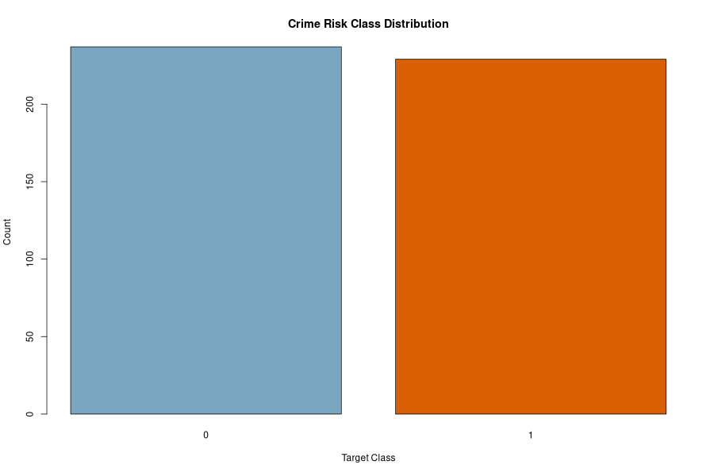
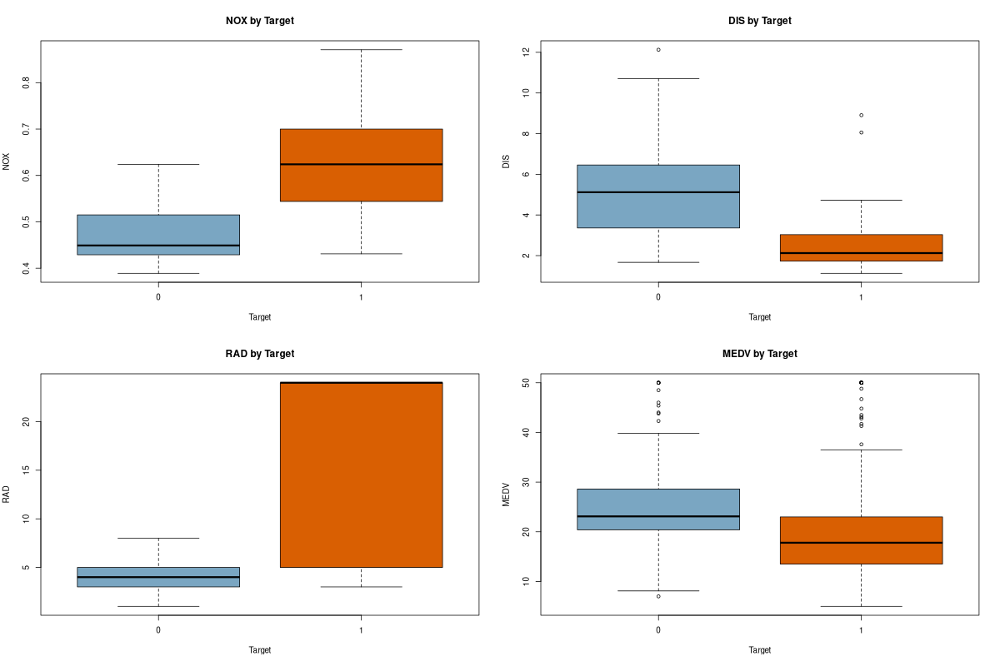
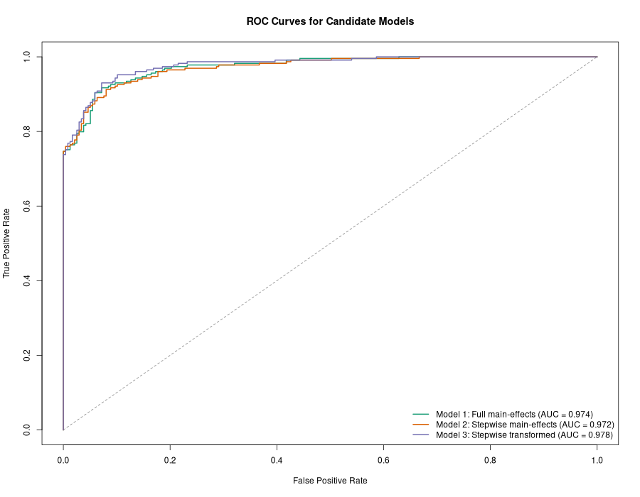

```{r}
objs <- readRDS("output/report_objects.rds")
summary_stats <- objs$summary_stats
correlation_df <- objs$correlation_df
correlation_compare <- objs$correlation_compare
model_metrics <- objs$model_metrics
coefficients_df <- objs$coefficients
confusions_df <- objs$confusions
evaluation_predictions <- objs$evaluation_predictions

fmt3 <- function(x) sprintf("%.3f", x)
fmt4 <- function(x) sprintf("%.4f", x)
top_corr <- subset(correlation_df, variable != "target")
top_pos <- head(top_corr[order(-top_corr$correlation_with_target), ], 3)
top_neg <- head(top_corr[order(top_corr$correlation_with_target), ], 3)
best_metrics <- model_metrics[model_metrics$model == "Model 3: Stepwise transformed", ]
best_coefs <- coefficients_df[coefficients_df$model == "Model 3: Stepwise transformed", ]
best_conf <- confusions_df[confusions_df$model == "Model 3: Stepwise transformed", ]
```

**Group Members:** Zoran G., Natalie K., Sabina B., Woodelyne D., Zaneta P.

# Data Exploration

The training file has `r nrow(objs$train)` observations and `r ncol(objs$train)` variables. There are `12` predictor variables and one binary response variable, `target`, which indicates whether crime is above the median level. The classes are fairly balanced, with `r sum(objs$train$target == 1)` neighborhoods in the high-crime group and `r sum(objs$train$target == 0)` in the low-crime group.

There are no missing values in either the training or evaluation data. That matters because it means the model building can focus on variable behavior and functional form instead of spending time on imputation.

Table 1 summarizes the predictor distributions.

```{r}
knitr::kable(summary_stats, digits = 3, caption = "Summary statistics for the training predictors.")
```

Pearson correlation was used as a first-pass linear screen and then checked against Spearman correlation as a rank-based alternative. Since the response is binary and most predictors are continuous, the two methods are used here only as exploratory guides rather than as formal decision rules. Kendall correlation could also be used, but Pearson and Spearman were enough to see whether the main patterns were stable.

The variables most positively associated with `target` under both correlation screens are `nox`, `age`, and `rad`. The most negative are `dis`, `zn`, `medv`, and `rm`. This pattern makes sense. Higher pollution, older housing stock, and easier highway access seem to be associated with higher crime risk, while higher home values and greater distance from employment centers tend to be associated with lower crime risk.

```{r}
knitr::kable(head(subset(correlation_df, variable != "target"), 8), digits = 3,
             caption = "Top positive correlations with the crime-risk target.")
neg_corr <- subset(correlation_df, variable != "target" & correlation_with_target < 0)
knitr::kable(head(neg_corr[order(neg_corr$correlation_with_target), ], 8),
             digits = 3,
             caption = "Most negative correlations with the crime-risk target.")
compare_view <- correlation_compare[correlation_compare$variable != "target", ]
compare_view <- compare_view[order(-abs(compare_view$correlation_with_target)), ]
knitr::kable(head(compare_view, 8), digits = 3,
             caption = "Pearson and Spearman correlation comparison with the target.")
```

Figure 1 shows the target split and Figure 2 compares several important predictors across the two classes. The boxplots show especially clear separation for `nox`, `dis`, `rad`, and `medv`, so those variables looked promising before modeling even started.

```{r}

```

```{r}

```

# Data Preparation

Since there were no missing values, we did not need to impute anything or create missing-value flags. Most of the preparation work was aimed at giving the logistic model a better chance to capture nonlinear relationships.

Dr. Jeff also mentioned that we should expect the data to be messy and be ready to handle missing values, weak relationships, or broken assumptions. In this specific file, the data turned out to be cleaner than expected because there were no missing values. Even so, there were still modeling issues to deal with, especially nonlinear relationships and some predictors with much stronger signal than others.

The preparation steps were:

1. Convert `chas` from a numeric indicator to a factor so the logistic model treats it as a categorical dummy.
2. Retain an untransformed baseline data set for a full main-effects logistic model and a stepwise-reduced main-effects model.
3. Create nonlinear transformations for a third candidate model:
   - `nox_sq = nox^2`
   - `rm_sq = rm^2`
   - `dis_sq = dis^2`
   - `medv_sq = medv^2`
   - `log_lstat = log(lstat)`
   - `log_tax = log(tax)`

We used these transformations because several predictors did not appear to have purely linear relationships with the log-odds of crime. Squared terms allow for curvature, while log transforms help stabilize skewed variables. After that, stepwise AIC was used to keep only the transformed terms that were actually helping the model.

# Build Models

This homework is centered on binary logistic regression, where the response variable is coded as `0/1` and the goal is to estimate the probability of the high-crime class and then classify observations using a cutoff.

We built three binary logistic regression models:

1. `Model 1: Full main-effects` uses all original predictors.
2. `Model 2: Stepwise main-effects` starts from Model 1 and applies AIC-based stepwise selection.
3. `Model 3: Stepwise transformed` starts from a richer specification with nonlinear terms, then applies AIC-based stepwise selection.

Table 2 compares the three candidate models using the required training-set metrics.

```{r}
metrics_view <- model_metrics
names(metrics_view) <- c("model", "AIC", "logLik", "accuracy", "error_rate", "precision",
                         "sensitivity", "specificity", "F1", "AUC")
metrics_view[, c("AIC", "logLik", "accuracy", "error_rate", "precision",
                 "sensitivity", "specificity", "F1", "AUC")] <-
  lapply(metrics_view[, c("AIC", "logLik", "accuracy", "error_rate", "precision",
                          "sensitivity", "specificity", "F1", "AUC")], as.numeric)
metrics_view$model <- c("Model 1", "Model 2", "Model 3")
knitr::kable(
  metrics_view,
  digits = 3,
  align = c("l", rep("r", 9)),
  caption = "Training-set performance comparison for the three logistic models."
)
```

Model 1 performs well, but it keeps every original variable even though several coefficients are weak. Model 2 is easier to explain because it drops the least useful terms and keeps `zn`, `nox`, `age`, `dis`, `rad`, `tax`, `ptratio`, and `medv`.

Model 3 gives the strongest overall fit. It has the lowest AIC (`r fmt3(best_metrics$aic)`), the best log likelihood (`r fmt3(best_metrics$log_likelihood)`), the highest accuracy (`r fmt3(best_metrics$accuracy)`), and the highest AUC (`r fmt3(best_metrics$auc)`). The final specification keeps `zn`, `nox_sq`, `rm`, `rm_sq`, `age`, `dis`, `dis_sq`, `rad`, `ptratio`, `medv`, and `medv_sq`.

In class, Dr. Jeff also briefly reviewed the logit function. In this setting, the model estimates the log-odds of being in the high-crime group:

$$
\log\left(\frac{p}{1-p}\right) = \beta_0 + \beta_1 x_1 + \cdots + \beta_k x_k
$$

This is useful because it turns a probability, which must stay between 0 and 1, into a scale that can be modeled as a linear combination of predictors. After fitting the model, the log-odds are converted back into predicted probabilities for classification.

The signs of the main coefficients are also reasonable:

- `nox_sq` is strongly positive, indicating that crime risk rises sharply as pollution increases.
- `age` is positive, implying older housing stock is associated with higher crime risk.
- `rad` and `ptratio` are positive, suggesting more highway accessibility and larger pupil-teacher ratios correspond to greater risk.
- `dis` and `dis_sq` together show that the distance effect is nonlinear rather than constant.
- `rm` with `rm_sq`, and `medv` with `medv_sq`, suggest curved relationships instead of simple one-direction effects.

Figure 3 compares the ROC curves for all three models.

```{r}

```

For reference, the coefficient table for the selected model is shown below.

```{r}
best_coef_view <- best_coefs[, c("term", "Estimate", "Std..Error", "z.value", "Pr...z..")]
names(best_coef_view) <- c("term", "estimate", "std_error", "z_value", "p_value")
knitr::kable(best_coef_view, digits = 4, caption = "Coefficient summary for the selected transformed logistic model.")
```

# Select Model

We selected `Model 3: Stepwise transformed` as the final model because it gives the best mix of fit and classification performance on the training data. This follows Dr. Jeff's point that model evaluation should not depend on a single number like AIC alone. Model 2 is simpler, but Model 3 improves accuracy, F1, and AUC while also lowering AIC. In this case, the added nonlinear terms seem justified rather than decorative.

That also matches the broader goal from the Zoom discussion: build multiple candidate models, compare them with several performance measures, and choose the one that makes the most sense overall rather than blindly taking the model with the single best score.

The final training-set confusion matrix is:

```{r}
conf_mat <- xtabs(count ~ actual + predicted, data = best_conf)
dimnames(conf_mat) <- list(
  "Actual Class" = c("0 = low crime", "1 = high crime"),
  "Predicted Class" = c("0 = low crime", "1 = high crime")
)
knitr::kable(conf_mat, caption = "Confusion matrix for the selected model at a 0.5 threshold.")
```

The final model's training-set metrics are:

- Accuracy: `r fmt3(best_metrics$accuracy)`
- Classification error rate: `r fmt3(best_metrics$error_rate)`
- Precision: `r fmt3(best_metrics$precision)`
- Sensitivity: `r fmt3(best_metrics$sensitivity)`
- Specificity: `r fmt3(best_metrics$specificity)`
- F1 score: `r fmt3(best_metrics$f1)`
- AUC: `r fmt3(best_metrics$auc)`

Using the required `0.5` cutoff, we generated predicted probabilities and binary classifications for all `r nrow(evaluation_predictions)` rows in the evaluation file. The complete output is saved as `output/evaluation_predictions.csv`. A preview is shown below.

The rows in the prediction file stay in the same order as the original evaluation dataset.

```{r}
knitr::kable(head(evaluation_predictions, 10), digits = 6,
             caption = "Preview of evaluation-set predictions from the selected model.")
```

# Appendix: R Code

```{r, results='asis'}
cat("```r\n")
cat(paste(readLines("analysis_hw3.R"), collapse = "\n"))
cat("\n```\n")
```
